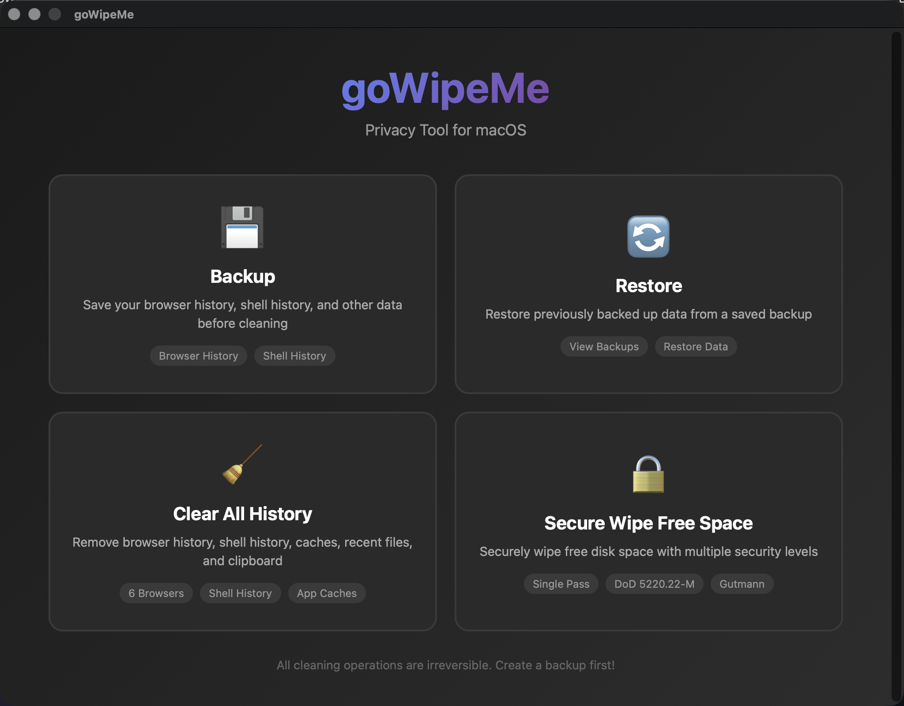

<div align="center">
  
  
  <p><strong>Privacy tool for macOS, Linux, and Windows</strong></p>
  
  <p><em>Written in <a href="https://golang.org">Go</a> </em></p>
</div>

<div align="center">
  
</div>

<br />

<div align="center">

[](https://github.com/Secunit-Mercantile/goWipeMe/releases)
[](LICENSE)
[](https://golang.org)
[](https://github.com/Secunit-Mercantile/goWipeMe/actions/workflows/ci.yml)

**CI Build Matrix**

- **TUI**: macOS (Intel, Apple Silicon), Linux (AMD64, ARM64, RISC-V 64), Windows (AMD64)
- **GUI**: macOS (Universal, Intel, Apple Silicon), Linux (AMD64, ARM64), Windows (AMD64)
- **GUI Linux RISC-V 64**: best-effort (may be skipped if unsupported by Wails)

</div>
<br />

> [!WARNING]
> This program is provided free and without any implied safety, functionality, or intended use. It is a hobby project by an old-school IT guy who likes to create fun utilities to learn and experiment. **PLEASE BACKUP YOUR SYSTEM BEFORE USING THIS TOOL.**

---

## 🚀 Features

### 💾 Backup & Restore
- **Backup** browser and shell history before cleaning
- **Restore** from previous backups at any time
- Stored locally in `~/.gowipeme/backups/`
- View backup details (timestamp, size, items)

### 🧹 Clear All History
- **Browser History**:
  - macOS: Safari, Chrome, Firefox, Edge, Brave, Arc
  - Linux: Chrome, Chromium, Firefox, Edge, Brave
  - Windows: Chrome, Firefox, Edge, Brave
- **Shell History**:
  - macOS/Linux: Bash, Zsh, Fish
  - Windows: PowerShell (plus Bash/Zsh/Fish files if present, e.g. Git Bash/MSYS)
- **Application Caches**:
  - macOS: `~/Library/Caches/` (selective)
  - Linux: `~/.cache/`
  - Windows: `%LOCALAPPDATA%\Temp`
- **Recent Files**:
  - macOS: sharedfilelist `.sfl2` (documents/servers/hosts/apps)
  - Linux: `recently-used.xbel`
  - Windows: Recent items + Jump Lists
- **Clipboard**: Clear clipboard contents (cross-platform; Linux may require a clipboard provider like `xclip`/`wl-clipboard`)
- **Dry-run preview** before deletion

### 🔒 Secure Wipe Free Space
Three DoD-grade wiping methods:
- **Single Pass (Zeros)**: Fast, sufficient for SSDs
- **DoD 5220.22-M**: 3-pass standard (0x00, 0xFF, random)
- **Gutmann Method**: 35-pass maximum security (very slow)

**Safety Features:**
- Two-phase wiping prevents OS crashes
- 10% safety buffer (minimum 1GB)
- Never fills disk to 100%

---

## 📦 Installation

### Download Pre-built Binaries

Download from [Releases](https://github.com/Secunit-Mercantile/goWipeMe/releases):

#### TUI (Terminal Interface)
```bash
# macOS Apple Silicon
tar -xzf gowipeme-tui-macos-apple-silicon.tar.gz
./gowipeme

# macOS Intel
tar -xzf gowipeme-tui-macos-intel.tar.gz
./gowipeme

# Linux
tar -xzf gowipeme-tui-linux-amd64.tar.gz
./gowipeme

# Windows
# Extract gowipeme-tui-windows-amd64.zip
gowipeme.exe
```

#### GUI (Graphical Interface)
```bash
# macOS Universal (recommended)
tar -xzf gowipeme-gui-macos-universal.tar.gz
open goWipeMe.app

# Linux
tar -xzf gowipeme-gui-linux-amd64.tar.gz
./gowipeme-gui

# Windows
# Extract gowipeme-gui-windows-amd64.zip
gowipeme-gui.exe
```

### Build from Source

**Requirements:**
- Go 1.25+
- Node.js 22 LTS
- Bun 1.0+
- Wails v2 (for GUI only)

```bash
# Clone repository
git clone https://github.com/Secunit-Mercantile/goWipeMe.git
cd goWipeMe

# Build TUI
make build-tui
./gowipeme

# Build GUI (requires Wails)
go install github.com/wailsapp/wails/v2/cmd/wails@v2.11.0
make frontend-deps
make build-gui
make sign-and-run  # macOS only
```

---

## 🎯 Usage

### GUI Interface

1. Launch the app
2. Choose from 4 options:
   - **Backup** - Save your data
   - **Restore** - Restore from backup
   - **Clear All History** - Remove traces
   - **Secure Wipe Free Space** - DoD-grade wiping

### TUI Interface

```bash
./gowipeme
```

Use arrow keys to navigate the menu:
- **Backup** - Save your data before cleaning
- **Restore** - Restore from a previous backup
- **Clear All History** - Preview and confirm deletion
- **Secure Wipe Free Space** - Select method and confirm
- **Exit** - Quit the program

---

## 📋 Supported Platforms

### Desktop Operating Systems
- ✅ macOS 10.13+ (Intel & Apple Silicon)
- ✅ Linux (AMD64, ARM64, RISC-V 64)
- ✅ Windows 10/11 (AMD64)

### Browsers Supported
- **macOS**: Safari, Chrome, Firefox, Edge, Brave, Arc
- **Linux**: Chrome, Chromium, Firefox, Edge, Brave
- **Windows**: Chrome, Firefox, Edge, Brave

### Shells Supported
- **macOS/Linux**: Bash, Zsh, Fish
- **Windows**: PowerShell (plus Bash/Zsh/Fish files if present)

---

## 🔐 Security & Privacy

### What Gets Cleaned
- **Browser Databases**: SQLite history files
- **Shell Files**: `.bash_history`, `.zsh_history`, Fish history
- **Cache Directories**: Application cache folders
- **Recent Files**: macOS `.sfl2`, Linux `recently-used.xbel`, Windows Recent + Jump Lists
- **Clipboard**: In-memory clipboard contents

### Wiping Algorithms

#### Single Pass (Zeros)
- Writes `0x00` bytes once
- **Fast** (~10-20 minutes for 100GB)
- Sufficient for modern SSDs with TRIM
- Prevents casual data recovery

#### DoD 5220.22-M (3-Pass)
- Pass 1: Write `0x00`
- Pass 2: Write `0xFF`
- Pass 3: Write random data
- **Medium** (~30-60 minutes for 100GB)
- US Department of Defense standard
- Prevents software-based recovery

#### Gutmann Method (35-Pass)
- 4 random passes + 27 pattern passes + 4 random passes
- **Very Slow** (hours for large disks)
- Historical overkill for modern drives
- Maximum paranoia mode

### Two-Phase Wiping Strategy

To prevent system crashes from filling the disk:

1. **Phase 1**: Fill 90% of free space with wipe data
2. **Phase 2**: Delete 50% of wipe files, then wipe freed space + original buffer
3. **Cleanup**: Remove all temporary files

This ensures the OS always has breathing room (10% or 1GB minimum).

---

## 🛠️ Advanced Usage

### Makefile Commands

```bash
# Development
make dev-tui          # Build and run TUI
make dev-gui          # Run Wails dev server

# Production Builds
make build-tui-release       # Optimized TUI
make build-gui-release       # Optimized GUI (Apple Silicon)
make build-gui-universal     # Universal binary (Intel + ARM)

# Testing
make test             # Run all tests

# Utilities
make sign-and-run     # Sign and run GUI (macOS)
make clean            # Remove build artifacts
```

### macOS Code Signing

For macOS, you need to sign the app to run without quarantine:

```bash
make sign-and-run
```

Or manually:
```bash
codesign --force --sign - "./build/bin/goWipeMe.app/Contents/MacOS/"*
codesign --force --deep --sign - "./build/bin/goWipeMe.app"
xattr -dr com.apple.quarantine "./build/bin/goWipeMe.app"
open "./build/bin/goWipeMe.app"
```

---

## 🐛 Troubleshooting

### Browser history not found
- Ensure browsers are **closed** before running
- Browser must have been opened at least once
- Check browser is installed in default location

### Permission denied
- Some operations require admin rights
- Run with `sudo` if needed (TUI only)
- macOS: Allow Full Disk Access in System Preferences

### Disk wipe fails
- Ensure at least **1GB free space** available
- Close resource-intensive applications
- Check disk is not write-protected

### GUI won't open (macOS)
- Run the code signing commands above
- Check System Preferences → Security & Privacy
- Allow the app to run in Privacy settings

---

## 📄 License

MIT License - see [LICENSE](LICENSE) for details

---

## 🙏 Acknowledgments

Built with:
- [Wails](https://wails.io/) - Go + Web GUI framework
- [Bubble Tea](https://github.com/charmbracelet/bubbletea) - TUI framework
- [Svelte 5](https://svelte.dev/) - Reactive web framework
- [Bun](https://bun.sh/) - Fast JavaScript runtime

---

## ⚖️ Legal Disclaimer

**THIS SOFTWARE IS PROVIDED "AS IS" WITHOUT WARRANTY OF ANY KIND.**

The authors and contributors of goWipeMe:
- Are **NOT responsible** for any data loss
- Are **NOT responsible** for any system damage
- Are **NOT responsible** for any unintended consequences
- **DO NOT guarantee** complete data erasure
- **DO NOT provide** data recovery services

**By using this software, you:**
- Accept **FULL RESPONSIBILITY** for any outcomes
- Acknowledge you have **BACKED UP YOUR DATA**
- Understand operations are **PERMANENT**
- Agree you are using this **AT YOUR OWN RISK**

This tool is intended for:
- Legitimate privacy protection
- Personal data sanitization
- Responsible disk maintenance

**NOT for:**
- Destroying evidence of illegal activity
- Circumventing forensic investigations
- Malicious purposes

Users are solely responsible for ensuring their use complies with applicable laws and regulations.

---

## 🤝 Contributing

Contributions welcome! Please:
1. Fork the repository
2. Create a feature branch
3. Submit a pull request

See [RELEASE.md](RELEASE.md) for release process.

---

## 📞 Support

- **Issues**: [GitHub Issues](https://github.com/Secunit-Mercantile/goWipeMe/issues)
- **Discussions**: [GitHub Discussions](https://github.com/Secunit-Mercantile/goWipeMe/discussions)

---

<div align="center">

**⚠️ REMEMBER: BACKUP YOUR DATA BEFORE USING ⚠️**

*Made with ❤️ for privacy-conscious users*

</div>
